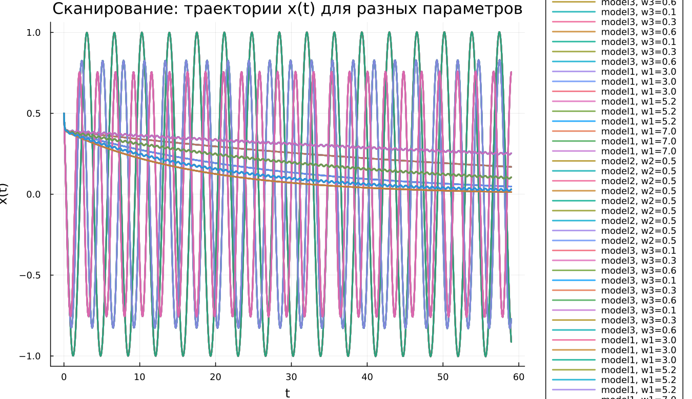
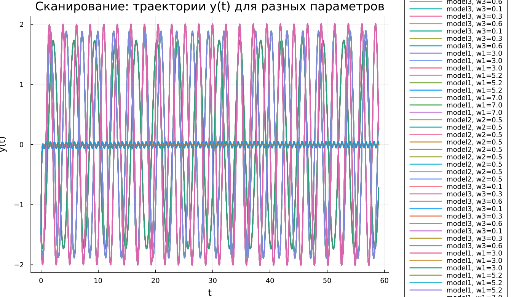

---
## Author
author:
  name: Бахи Сиди Али
  email: 1032234211@rudn.ru
  affiliation:
    - name: Российский университет дружбы народов
      country: Российская Федерация
      postal-code: 117198
      city: Москва
      address: ул. Миклухо-Маклая, д. 6

## Title
title: "Математическое моделирование"
subtitle: "Лабораторная работа № 4"
license: "CC BY"
---

# Цель работы

Исследовать свойства и поведение решений уравнения гармонического осциллятора при различных условиях.

# Задание

1. Построить решение уравнения гармонического осциллятора без учета затухания  
2. Записать уравнение свободных затухающих колебаний и построить его решение, а также фазовый портрет  
3. Рассмотреть случай действия внешней силы, построить решение и фазовый портрет системы  

# Выполнение лабораторной работы

## Теоретические сведения

Динамика множества физических процессов — от механических колебаний до электрических и химических систем — при ряде допущений описывается единым уравнением. Оно известно как модель линейного гармонического осциллятора и широко применяется в теории колебаний.

Общее уравнение имеет вид:
$$
\ddot{x} + 2\gamma \dot{x} + \omega_0^2 x = 0
$$

где $x$ — координата состояния системы, $\gamma$ — коэффициент диссипации энергии, $\omega_0$ — собственная частота.

Это линейное дифференциальное уравнение второго порядка, описывающее эволюцию системы во времени.

Если потери энергии отсутствуют ($\gamma = 0$), уравнение принимает вид:
$$
\ddot{x} + \omega_0^2 x = 0
$$

Для определения конкретного решения задаются начальные условия:
$$
\begin{cases}
x(t_0) = x_0 \\
\dot{x}(t_0) = y_0
\end{cases}
$$

Переход к системе первого порядка осуществляется введением переменной $y$:
$$
\begin{cases}
\dot{x} = y \\
\dot{y} = -\omega_0^2 x
\end{cases}
$$

Начальные условия принимают вид:
$$
\begin{cases}
x(t_0) = x_0 \\
y(t_0) = y_0
\end{cases}
$$

Переменные $x$ и $y$ формируют фазовое пространство. В этом пространстве каждая траектория соответствует решению системы, а совокупность траекторий образует фазовый портрет.

## Задача

Требуется исследовать поведение системы и построить фазовые портреты для следующих случаев:

1. Без затухания и без внешнего воздействия:
$$
\ddot{x} + 5.2x = 0
$$

2. С затуханием:
$$
\ddot{x} + 14\dot{x} + 0.5x = 0
$$

3. С затуханием и внешней силой:
$$
\ddot{x} + 13\dot{x} + 0.3x = 0.8\sin(9t)
$$

Интервал моделирования:
$$
t \in [0;59], \quad h = 0.05, \quad x_0 = 0.5, \quad y_0 = -1.5
$$

### Преобразование моделей

1. Без затухания:
$$
\begin{cases}
\dot{x} = y \\
\dot{y} = -\omega_0^2 x
\end{cases}
$$

2. С затуханием:
$$
\begin{cases}
\dot{x} = y \\
\dot{y} = -2\gamma y - \omega_0^2 x
\end{cases}
$$

3. С внешней силой:
$$
\begin{cases}
\dot{x} = y \\
\dot{y} = F(t) - 2\gamma y - \omega_0^2 x
\end{cases}
$$

Для численного анализа применялись внешние программные модули:





## Базовые эксперименты

### Первая модель (model_type = model1)

На графике $y(t)$ наблюдается строго периодическое движение без снижения амплитуды. Колебания сохраняют форму и повторяются на всём интервале времени.

Такая динамика соответствует идеализированной системе без потерь энергии. Отсутствие затухания приводит к сохранению полной энергии.

Фазовый портрет представляет собой замкнутую кривую, что указывает на устойчивый периодический режим. Система возвращается к тем же состояниям.

Итак, первая модель описывает классические незатухающие колебания.

### Вторая модель (model_type = model2)

График $y(t)$ демонстрирует быстрое уменьшение амплитуды. После краткого переходного процесса значения стремятся к нулю.

Причина заключается в наличии демпфирования, которое приводит к рассеянию энергии.

Фазовая траектория быстро стягивается к точке равновесия, что отражает стабилизацию системы.

Таким образом, система демонстрирует затухающий апериодический режим.

### Третья модель (model_type = model3)

После начального переходного этапа система выходит на режим устойчивых колебаний малой амплитуды.

Внешняя сила компенсирует потери энергии, поддерживая движение.

Фазовый портрет формирует компактную область, соответствующую установившемуся режиму.

Следовательно, наблюдаются вынужденные колебания.

## Параметрическое сканирование

### Траектории $x(t)$

Исследование показало:

- в первой модели параметр влияет на частоту;
- во второй — на скорость затухания;
- в третьей — на режим вынужденных колебаний.

### Траектории $y(t)$

Результаты подтверждают:

- устойчивые колебания без затухания;
- стремление к равновесию;
- наличие вынужденных колебаний.

## Время вычислений

Численный анализ показал:

- минимальные затраты для первой модели;
- увеличение времени при наличии затухания;
- наибольшие затраты при внешнем воздействии.

## Анализ метрики norm_final

Рассматривается величина:
$$
\text{norm\_final} = \sqrt{x(t_{final})^2 + y(t_{final})^2}
$$

Наблюдения:

- первая модель — значение остаётся значительным;
- вторая — стремится к нулю;
- третья — стабилизируется на малом уровне.

# Выводы

1. Консервативная система сохраняет амплитуду колебаний  
2. Демпфирование приводит к затуханию движения  
3. Внешняя сила формирует устойчивые вынужденные колебания  
4. Параметры системы определяют характер динамики  
5. Численные методы обеспечивают эффективное моделирование  
6. Метрика $\text{norm\_final}$ отражает тип поведения системы  

# Список литературы {.unnumbered}

1. [Гармонический осциллятор](https://ru.wikipedia.org/wiki/Гармонический_осциллятор)  
2. [Модели колебательных систем](https://www.numamo.org/HTML/Articles/Oscillator.html)  
