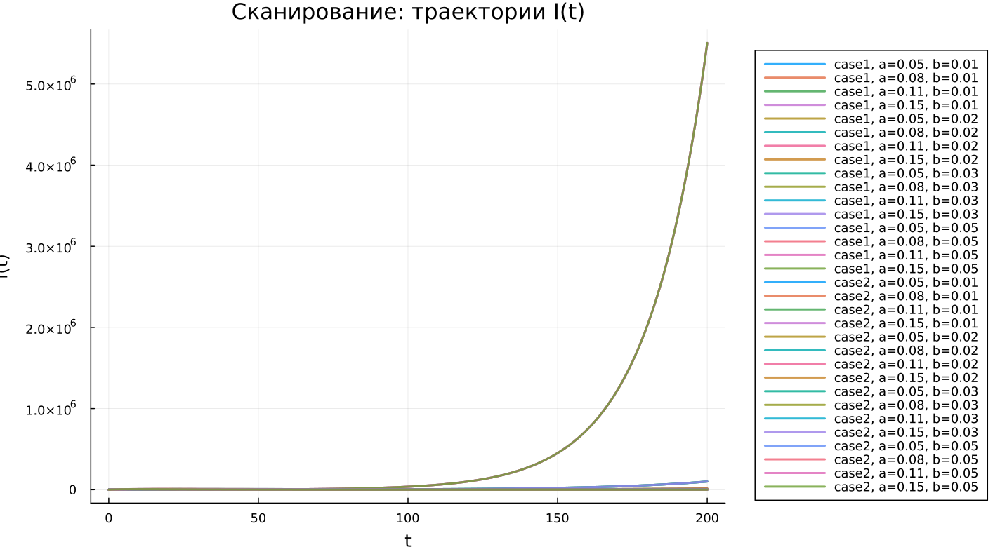

--- 
## Author
author:
  name: Бахи Сиди Али
  email: 1032234211@rudn.ru
  affiliation:
    - name: Российский университет дружбы народов
      country: Российская Федерация
      postal-code: 117198
      city: Москва
      address: ул. Миклухо-Маклая, д. 6

## Title
title: "Математическое моделирование"
subtitle: "Лабораторная работа № 6"
license: "CC BY"
---

# Цель работы

Исследовать эпидемиологическую модель $SIR$ и проанализировать особенности её динамики.

# Задание

1. Изучить математическую модель распространения эпидемии.
2. Построить графики изменения численности особей в трёх группах. Проанализировать развитие эпидемии для случаев: $I(0)\leq I^*$ и $I(0)>I^*$.

# Выполнение лабораторной работы

## Теоретические сведения

Рассмотрим простую модель эпидемического процесса. Пусть имеется изолированная популяция численностью $N$, которая делится на три категории. К первой категории относятся восприимчивые к заболеванию, но ещё здоровые особи. Их число обозначим через $S(t)$. Вторая категория включает инфицированных особей, способных распространять заболевание; их количество обозначается $I(t)$. Третья категория описывает особей, которые выздоровели и приобрели иммунитет к болезни; эта группа обозначается $R(t)$.

Пока число инфицированных не превышает критического уровня $I^*$, предполагается, что заболевшие изолированы и не передают инфекцию здоровым. Если же выполняется условие $I(t)>I^*$, инфицированные начинают заражать восприимчивых особей.

Тогда изменение числа восприимчивых особей задаётся следующим образом:

$$
\frac{dS}{dt}=
 \begin{cases}
	-\alpha S &\text{, если $I(t) > I^*$}
	\\   
	0 &\text{, если $I(t) \leq I^*$}
 \end{cases}
$$

Так как восприимчивая особь после заражения переходит в группу инфицированных, скорость изменения $I(t)$ определяется разностью между количеством новых заболевших и числом инфицированных, переходящих в группу выздоровевших. Следовательно:

$$
\frac{dI}{dt}=
 \begin{cases}
	\alpha S -\beta I &\text{, если $I(t) > I^*$}
	\\   
	-\beta I &\text{, если $I(t) \leq I^*$}
 \end{cases}
$$

Число выздоровевших особей, получивших иммунитет, изменяется по закону:

$$
\frac{dR}{dt} = \beta I
$$

Параметры $\alpha$ и $\beta$ являются коэффициентами заболеваемости и выздоровления соответственно. Для однозначного определения решения системы необходимо задать начальные условия. Предполагается, что в начальный момент времени $t=0$ известны значения $S(0)$, $I(0)$ и $R(0)$. Для анализа распространения заболевания требуется рассмотреть два режима: $I(0) \leq I^*$ и $I(0)>I^*$.

### Задача

На острове возникла эпидемия. Известно, что общая численность населения составляет $N=11400$. В начальный момент времени $(t=0)$ число заболевших людей, являющихся распространителями инфекции, равно $I(0)=250$, а число людей с иммунитетом равно $R(0)=47$. Тогда количество восприимчивых к заболеванию, но пока здоровых людей определяется выражением:

$$
S(0)=N-I(0)-R(0)
$$

Необходимо построить графики изменения численности групп $S(t)$, $I(t)$ и $R(t)$.

Также требуется рассмотреть два случая развития эпидемии:

1. $I(0)\leq I^*$
2. $I(0)>I^*$

Для моделирования процесса и построения графиков использовались внешние файлы с программным кодом:





## Базовые эксперименты

### Первая модель (model_type = case1)

Для первой модели получается необычная динамика, нехарактерная для стандартной модели $SIR$. Количество восприимчивых особей $S(t)$ не меняется со временем, что соответствует условию $dS/dt = 0$. При этом число инфицированных $I(t)$ возрастает по экспоненциальному закону, а величина $R(t)$ уменьшается и со временем принимает отрицательные значения.

Такой результат не имеет корректной эпидемиологической интерпретации. Причина заключается в структуре заданной системы уравнений: в ней отсутствует механизм, ограничивающий рост числа инфицированных, а переменная $R(t)$ теряет физический смысл, поскольку численность группы не может быть отрицательной.

Фазовый портрет подтверждает это поведение. Поскольку $S(t)$ остаётся неизменным, траектория почти превращается в вертикальную линию. Изменение состояния системы происходит фактически только по координате $I$, поэтому модель сводится к одномерной динамике.

Таким образом, первая модель описывает неограниченное увеличение числа инфицированных без выхода на устойчивый режим и не может считаться адекватным описанием распространения заболевания.

### Вторая модель (model_type = case2)

Во второй модели наблюдается поведение, близкое к классической динамике $SIR$-системы. Количество восприимчивых $S(t)$ постепенно уменьшается, что отражает процесс заражения. Число инфицированных $I(t)$ сначала растёт, затем достигает максимального значения, после чего начинает снижаться и стремится к нулю. Численность группы $R(t)$, наоборот, монотонно увеличивается.

Такой характер изменения переменных соответствует распространению инфекции в популяции конечной численности. В начале эпидемии заболевание активно передаётся между особями, но затем из-за уменьшения числа восприимчивых скорость заражения снижается, и эпидемия постепенно затухает.

Фазовая траектория имеет вид незамкнутой кривой. Сначала она поднимается вверх, что соответствует росту $I$ при уменьшении $S$, затем опускается вниз, показывая спад числа инфицированных. Это отражает прохождение системы через пик эпидемии и последующее затухание процесса.

В отличие от первой модели, здесь система стремится к стационарному состоянию: $I(t) \to 0$, величина $S(t)$ выходит на некоторый остаточный уровень, а $R(t)$ достигает конечного значения.

## Параметрическое сканирование

### Траектории $S(t)$ для различных параметров

Анализ графиков $S(t)$ показывает, что изменение параметров по-разному влияет на две модели. В первой модели (case1) значение $S(t)$ остаётся постоянным независимо от выбранных параметров. Это связано с тем, что для данной модели выполняется уравнение $dS/dt = 0$, поэтому динамика восприимчивых отсутствует.

Во второй модели (case2) численность восприимчивых убывает, причём скорость этого убывания зависит от параметра $a$. При увеличении $a$ заражение происходит быстрее, поэтому группа $S(t)$ сокращается интенсивнее.

Основные результаты:

- в первой модели величина $S(t)$ не изменяется;
- во второй модели $S(t)$ монотонно уменьшается;
- параметр $a$ определяет скорость уменьшения числа восприимчивых.

### Траектории $I(t)$ для различных параметров

В первой модели для всех рассмотренных параметров наблюдается экспоненциальное увеличение числа инфицированных $I(t)$. При росте параметра $b$ скорость увеличения становится значительно выше, что приводит к очень большим значениям $I(t)$.

Во второй модели поведение более реалистично. Количество инфицированных сначала возрастает, достигает максимума, а затем постепенно снижается. Параметр $a$ влияет как на высоту пика, так и на момент его достижения. При больших значениях $a$ максимум достигается быстрее, после чего спад также происходит более интенсивно.

Можно отметить следующее:

- первая модель показывает неограниченный рост числа инфицированных;
- вторая модель воспроизводит типичную эпидемическую волну;
- параметры влияют на скорость распространения инфекции и величину максимума $I(t)$.

### Траектории $R(t)$ для различных параметров

Для первой модели характерно уменьшение $R(t)$, причём значения этой переменной становятся отрицательными и быстро возрастают по модулю. Это указывает на некорректность модели, поскольку численность выздоровевших не может быть меньше нуля.

Во второй модели наблюдается противоположная картина: $R(t)$ монотонно возрастает и постепенно приближается к предельному значению. Параметры влияют на скорость накопления выздоровевших: чем интенсивнее процесс заражения, тем быстрее увеличивается группа $R(t)$.

Итоги анализа:

- первая модель приводит к нефизичным значениям $R(t)$;
- во второй модели число выздоровевших закономерно увеличивается;
- параметры изменяют скорость выхода $R(t)$ на насыщение.

### Фазовые траектории для различных параметров

Фазовые портреты наглядно показывают различие между двумя моделями.

В первой модели все траектории имеют вид вертикальных линий, так как переменная $S$ остаётся постоянной. Это означает, что полноценная двумерная динамика в плоскости $(S,I)$ отсутствует.

Во второй модели фазовые траектории представляют собой характерные кривые, описывающие развитие эпидемии. Сначала число инфицированных увеличивается при уменьшении числа восприимчивых, затем после достижения максимума $I$ начинает снижаться, тогда как $S$ продолжает уменьшаться.

Следовательно, изменение параметров не меняет качественного характера моделей:

- первая модель остаётся вырожденной;
- вторая модель сохраняет реалистичную структуру эпидемического процесса.

### Анализ метрики norm_final

Для сравнения моделей рассматривалась метрика:

$$
\text{norm\_final} = \sqrt{S(t_{final})^2 + I(t_{final})^2 + R(t_{final})^2}.
$$

В первой модели значение $\text{norm\_final}$ быстро увеличивается при росте параметра $b$. Это объясняется экспоненциальным увеличением $I(t)$ и уменьшением $R(t)$, из-за чего итоговая норма становится очень большой.

Во второй модели значения этой метрики заметно меньше и изменяются более плавно. Это связано с тем, что система выходит на стационарный режим, где $I(t) \to 0$, а величины $S$ и $R$ остаются конечными.

Таким образом:

- в первой модели метрика возрастает практически без ограничения;
- во второй модели она характеризует конечное состояние системы.

### Анализ максимального числа инфицированных

Максимальное число инфицированных $I_{max}$ существенно зависит от параметров модели.

В первой модели значения $I_{max}$ становятся чрезвычайно большими, поскольку в системе нет механизма, ограничивающего рост инфицированных. Увеличение параметра $b$ приводит к резкому росту максимума.

Во второй модели максимум числа инфицированных остаётся конечным и определяется параметром $a$. При увеличении $a$ эпидемический пик наступает быстрее, но его величина не становится неограниченной.

Следовательно:

- первая модель даёт неограниченное увеличение $I_{max}$;
- вторая модель описывает ограниченную эпидемическую волну.

### Время вычислений

Результаты бенчмаркинга показывают, что время численного решения во всех экспериментах остаётся малым и имеет порядок $\sim 10^{-4}$ сек.

Для обеих моделей изменение параметров почти не влияет на вычислительное время. Небольшие колебания связаны с особенностями численного метода и подбором адаптивного шага интегрирования.

Можно сделать следующие выводы:

- обе модели быстро решаются численными методами;
- изменение параметров практически не увеличивает вычислительную сложность;
- даже при экспоненциальном росте решений в case1 время расчёта остаётся небольшим.

## Выводы

1. Первая модель (case1) показывает неограниченный экспоненциальный рост числа инфицированных при неизменном количестве восприимчивых, что указывает на её нефизичный характер.
2. Вторая модель (case2) воспроизводит типичную динамику эпидемии: рост числа инфицированных, достижение пика, последующее снижение и переход к стационарному состоянию.
3. Фазовые портреты подтверждают различие моделей: в case1 траектория вырождается в вертикальную линию, а в case2 формируется полноценная фазовая кривая.
4. Параметры $a$ и $b$ заметно влияют на поведение системы: $a$ задаёт скорость сокращения числа восприимчивых, а $b$ влияет на интенсивность изменения числа инфицированных.
5. Метрика $\text{norm\_final}$ позволяет количественно сравнить модели: в первой модели она быстро возрастает, во второй — стабилизируется.
6. Максимальное число инфицированных $I_{max}$ в первой модели растёт без ограничения, тогда как во второй модели остаётся конечным.
7. Численные эксперименты выполняются эффективно, а изменение параметров почти не влияет на время вычислений.

# Список литературы {.unnumbered}

1. [Конструирование эпидемиологических моделей](https://habr.com/ru/post/551682/)
2. [Зараза, гостья наша](https://nplus1.ru/material/2019/12/26/epidemic-math)
